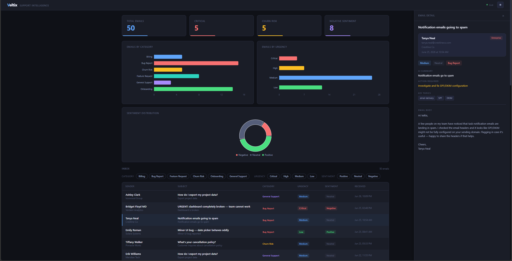
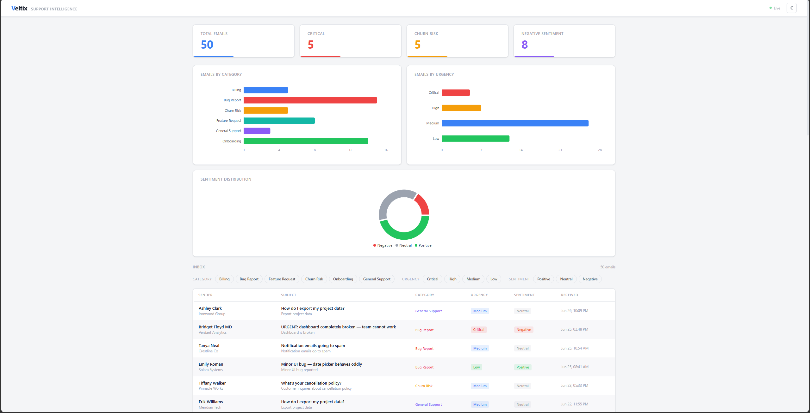

# Veltix Support Intelligence

Veltix is a full-stack support inbox analytics dashboard built as a portfolio project. It simulates the customer support inbox of a fictional B2B project management SaaS, then uses an LLM to extract structured insight (category, sentiment, urgency, summary, and more) from raw email text, and surfaces it in a live dashboard.

The goal of this project isn't a minimal demo. It's built with production-realistic patterns: an archive-first data pipeline, Pydantic response validation, structured AI extraction, and a clean separation between raw and processed data, all so the codebase reflects how a real system would be designed at small scale.

> Note: "Veltix" and its email content are entirely fictional. All emails are AI-generated for demonstration purposes.

## Screenshots

**Dark mode, with the email detail panel open**


**Light mode**


## Features

- Fake but realistic support emails generated across 6 categories (billing, bug reports, feature requests, churn risk, onboarding, general support)
- AI-powered extraction of category, sentiment, urgency, summary, action items, and key topics using Groq's Llama 3.3 70B model
- FastAPI backend with Pydantic response models for every endpoint
- Archive-first SQLite storage: raw emails are never overwritten, so extraction can be safely re-run at any time
- React dashboard with filterable inbox table, summary stat cards, and category/urgency/sentiment charts
- Slide-in email detail panel with full body text and AI-extracted metadata
- Light and dark theme support

## Tech Stack

**Backend**
- Python, FastAPI, Pydantic
- SQLite
- Groq API (`llama-3.3-70b-versatile`)
- Faker (fake email generation)

**Frontend**
- React + Vite
- Tailwind CSS v4
- Recharts

## Architecture

The data pipeline runs in three stages:

1. **Generate** (`generator.py`): Produces realistic fake support emails using Faker, across 6 weighted categories with varied tone and urgency.
2. **Extract** (`extractor.py`): Sends each email to Groq for structured extraction (category, sentiment, urgency, summary, action required, key topics), returned as JSON.
3. **Ingest** (`database.py`): Loads both the raw email and the extracted data into SQLite, using `INSERT OR IGNORE` for idempotent re-runs.

The database intentionally has two tables:

- `raw_emails`, the original email exactly as received. This is the source of truth and is never modified.
- `processed_emails`, the AI-extracted structured data, linked back to the raw email by ID.

Splitting the data this way means extraction can be re-run at any time (say, after tuning the prompt) without touching or losing the original data. This mirrors how a real ingestion pipeline would be designed for auditability.

The FastAPI backend exposes four endpoints (`/health`, `/stats`, `/emails`, `/emails/{id}`), each validated against a Pydantic response model, so the API's shape is enforced automatically and documented at `/docs`.

## Getting Started

### Prerequisites

- Python 3.11+
- Node.js 18+
- A free [Groq API key](https://console.groq.com)

### 1. Clone the repo

```bash
git clone https://github.com/BendotLabs/Veltix-Support-Intelligence.git
cd Veltix-Support-Intelligence
```

### 2. Backend setup

```bash
python -m venv venv
venv\Scripts\activate      # Windows
source venv/bin/activate   # macOS/Linux

pip install -r requirements.txt
```

Copy `.env.example` to `.env` and add your Groq API key:

```
GROQ_API_KEY=your-key-here
```

### 3. Run the data pipeline

From the project root, with the venv active:

```bash
python backend/generator.py    # generates data/emails.json
python backend/extractor.py    # generates data/emails_enriched.json
python backend/database.py     # builds data/veltix.db
```

### 4. Start the backend

```bash
uvicorn backend.main:app --reload
```

The API will be live at `http://localhost:8000`, with interactive docs at `http://localhost:8000/docs`.

### 5. Start the frontend

In a separate terminal:

```bash
cd frontend
npm install
npm run dev
```

The dashboard will be live at `http://localhost:5173`.

## Project Structure

```
veltix/
├── backend/
│   ├── generator.py       # fake email generation
│   ├── extractor.py       # Groq-powered AI extraction
│   ├── database.py        # SQLite schema and queries
│   ├── main.py             # FastAPI app and routes
│   └── models.py           # Pydantic response models
├── frontend/
│   └── src/
│       ├── components/     # StatCards, EmailTable, EmailPanel, layout, charts
│       ├── hooks/           # useFetch
│       └── lib/              # api.js
├── data/                    # generated at runtime, gitignored
├── screenshots/
└── README.md
```

## License

This project is licensed under the MIT License. See the [LICENSE](LICENSE) file for details.